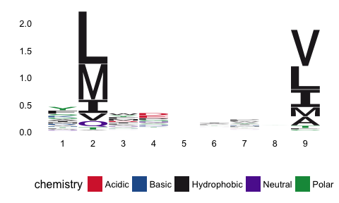
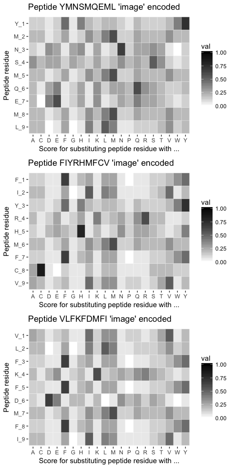

PepTools - An Immunoinformatics (Immunological Bioinformatics) R-package for working with peptide data
================

PepTools
========

The aim of this package is to supply a set of tools, which will ease working with peptide data within the field of immunoinformatics.

Getting started
---------------

Using Hadley Wickham's brilliant `devtools` package, we can easily install `PepTools` like so:

``` r
install.packages("devtools")
devtools::install_github("leonjessen/PepTools")
```

Once the package has been installed, we can simply load it like so:

``` r
library("PepTools")
```

PSSM Examples
-------------

`PepTools` comes with an example data set of 5,000 9-mer peptides, which have been predicted by [NetMHCpan 4.0 Server](http://www.cbs.dtu.dk/services/NetMHCpan-4.0/) to be strong binders to HLA-A\*02:01.

We can view the first 10 peptides like so

``` r
PEPTIDES %>% head(10)
```

    ##  [1] "YMNSMQEML" "FIYRHMFCV" "VLFKFDMFI" "KLLDRFPVA" "RVLDDFTKL"
    ##  [6] "ILKTDILLL" "GLQASIYRI" "AMHAWVFYL" "SMDFGFFEV" "ALPQFNPVV"

and derive the count matrix:

``` r
PEPTIDES %>% pssm_counts %>% .[1:9,1:10]
```

    ##     A   R   N   D  C   Q   E   G   H   I
    ## 1 324 266 149   8 16 134  24 331 191 322
    ## 2  40   0   0   0  0 264   0   0   0 566
    ## 3 286  23 228 409 54 142  80 158 168 366
    ## 4 283 126 317 710 72 219 704 410 223  99
    ## 5 250 151 264 352 53 215 307 388 306 307
    ## 6 226  74 283 266 56 230 199 213 168 515
    ## 7 225  62 219 141 73 209 221  45 342 365
    ## 8 299 241 282 104 46 319 364 233 318 127
    ## 9 444   1   0   0 62   0   1   1   0 872

and the frequency matrix:

``` r
PEPTIDES %>% pssm_freqs %>% .[1:9,1:10]
```

    ##        A      R      N      D      C      Q      E      G      H      I
    ## 1 0.0648 0.0532 0.0298 0.0016 0.0032 0.0268 0.0048 0.0662 0.0382 0.0644
    ## 2 0.0080 0.0000 0.0000 0.0000 0.0000 0.0528 0.0000 0.0000 0.0000 0.1132
    ## 3 0.0572 0.0046 0.0456 0.0818 0.0108 0.0284 0.0160 0.0316 0.0336 0.0732
    ## 4 0.0566 0.0252 0.0634 0.1420 0.0144 0.0438 0.1408 0.0820 0.0446 0.0198
    ## 5 0.0500 0.0302 0.0528 0.0704 0.0106 0.0430 0.0614 0.0776 0.0612 0.0614
    ## 6 0.0452 0.0148 0.0566 0.0532 0.0112 0.0460 0.0398 0.0426 0.0336 0.1030
    ## 7 0.0450 0.0124 0.0438 0.0282 0.0146 0.0418 0.0442 0.0090 0.0684 0.0730
    ## 8 0.0598 0.0482 0.0564 0.0208 0.0092 0.0638 0.0728 0.0466 0.0636 0.0254
    ## 9 0.0888 0.0002 0.0000 0.0000 0.0124 0.0000 0.0002 0.0002 0.0000 0.1744

and the bits of information matrix;

``` r
PEPTIDES %>% pssm_freqs %>% pssm_bits %>% .[1:9,1:10]
```

    ##             A            R           N            D            C
    ## 1 0.029691657 0.0243764842 0.013654497 0.0007331273 0.0014662547
    ## 2 0.017770267 0.0000000000 0.000000000 0.0000000000 0.0000000000
    ## 3 0.019255393 0.0015485106 0.015350453 0.0275365579 0.0036356336
    ## 4 0.019434006 0.0086525964 0.021768834 0.0487566939 0.0049443408
    ## 5 0.004053918 0.0024485666 0.004280938 0.0057079169 0.0008594307
    ## 6 0.007492616 0.0024533344 0.009382346 0.0088187426 0.0018565774
    ## 7 0.010106570 0.0027849214 0.009837061 0.0063334504 0.0032790204
    ## 8 0.007037063 0.0056720139 0.006636962 0.0024476741 0.0010826251
    ## 9 0.167149089 0.0003764619 0.000000000 0.0000000000 0.0233406385
    ##             Q            E            G           H           I
    ## 1 0.012279883 0.0021993820 0.0303331439 0.017503415 0.029508376
    ## 2 0.117283761 0.0000000000 0.0000000000 0.000000000 0.251449276
    ## 3 0.009560370 0.0053861238 0.0106375945 0.011310860 0.024641516
    ## 4 0.015039037 0.0483446655 0.0281552740 0.015313722 0.006798469
    ## 5 0.003486370 0.0049782116 0.0062916812 0.004961996 0.004978212
    ## 6 0.007625229 0.0065974804 0.0070616247 0.005569732 0.017073881
    ## 7 0.009387880 0.0099268974 0.0020213140 0.015361986 0.016395102
    ## 8 0.007507769 0.0085668592 0.0054837313 0.007484234 0.002988987
    ## 9 0.000000000 0.0003764619 0.0003764619 0.000000000 0.328274787

Sequence Logo Examples
----------------------

Using the `ggseqlogo` package, we can visualise the bits matrix:

``` r
PEPTIDES %>% pssm_freqs %>% pssm_bits %>% t %>% ggseqlogo(method="custom")
```



and compare with the `ggseqlogo` build in peptide-to-bits conversion:

``` r
PEPTIDES %>% ggseqlogo
```


Peptide Encoding for Deep Learning
----------------------------------

`PepTools` also contain function for encoding peptides:

``` r
PEPTIDES %>% pep_encode %>% dim
```

    ## [1] 5000    9   20

As can be seen from the dimensions, `pep_encode` creates a 3D array or a tensor with 5,000 rows, 9 columns and 20 slices, corresponding to `n_peptides x l_peptide x l_enc`, where the encoding is the `BLOSUM62` matrix. This way each peptide is encoded as an'image', which can then be used as input to a Deep Learning model. To get a better understanding of what is going on, we can plot the 3 first encoded peptide 'images':

``` r
PEPTIDES %>% pep_plot_images
```


